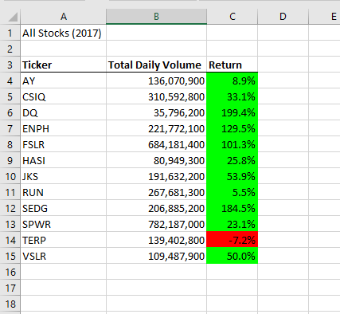
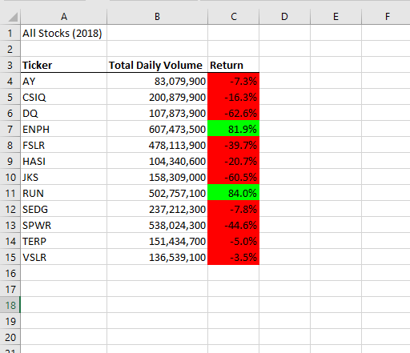
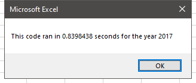
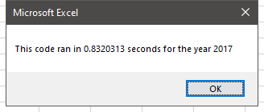
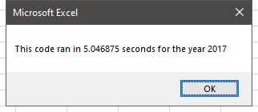
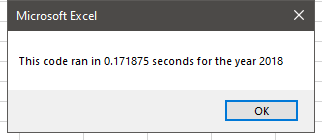

# Challege 2

## Overview of Project

### Background
I made a project for Steve to help him do stock analysis, but the code only worked well for a dozen stocks.
He wants to expand the dataset to include the entire stock market over the last few years, so the code needs to be modified to make it more efficiently.

### Purpose
In this project, I will edit, or refactor, the code to loop through all the data one time in order to collect the same information more efficiently.
I will compare two codes and summarize their advantages and disadvantages.

## Results

there is only one loop after refactoring. The result screenshots are below:
- 2017 and 2018 stock analysis

- Runtime of original code (two loops)

- Runtime of modified code (one loop)

After changing the code to one loop, the runtime get less

## Summary

### advantages and disadvantages of refactoring code in general
Advantages: In general, the refactoring code would help computer save memories and run faster. The advantages would be more obvious as the dataset get larger.
disadvantages: it is time consuming. if the code was complex, coder would get lost easily.

### advantages and disadvantages of the original and refactored VBA script
####The original code
advantages: Compare to modified version, the original version is less tricky and easier to understand.
disadvantages: For each stock, the code loops through all the data, so in total it goes through the whole dataset 12 times, which is very slow and not efficient.

####refactored script
advantages: faster and more efficient. It Only loops the dataset once and some conditional statements can be removed. For example, when the ending price and start price are checked, the refactored code does not check the stock code anymore.
disadvantages: It is trickier than the original one. Also when I modified the code structure, Something was added and something was deleted. I made mistakes for several times before finishing it.
